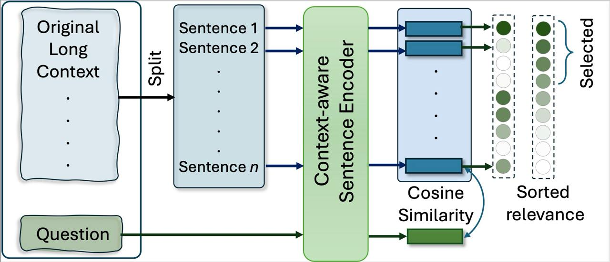
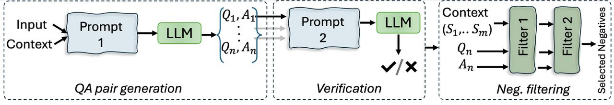

<div style="display: flex; align-items: center;">
    <div style="flex-grow: 1;" align="center">
        <h2 align="center">Prompt Compression with Context-Aware Sentence Encoding for Fast and Improved LLM Inference</h2>
    </div>
</div>

Official implementation of the AAAI 25 paper:

> [**Prompt Compression with Context-Aware Sentence Encoding for Fast and Improved LLM Inference**](https://arxiv.org/abs/2409.01227) <br>
> Barys Liskavets, Maxim Ushakov, Shuvendu Roy, Mark Klibanov, Ali Etemad, Shane Luke<br>
> In Proceedings of the Association for the Advancement of Artificial Intelligence  (AAAI 2025)

[](https://arxiv.org/pdf/2409.01227.pdf)

<hr />





#### Overview:
- Data curation
- Compressor model training
- Inference & Evaluation
- Usage


#### Data curation

To train cpc-1.0 wiki-text based data with synthetically generated contexts, questions and positives should be collected.
It can be done as follows:
- using upstream gpt-3.5:
```
python -m data_collection.prepare_dataset \
    --prompts_file configs/prompts.json \
    --qa_generation_dst_file /path/to/qa_generations.json \
    --max_examples 32000 \
    --openai_api_token ${YOUR_API_TOKEN} \
    --max_context_length ${MAX_CONTEXT_LENGTH}
```
- or phi-3:
```
python -m data_collection.prepare_dataset \
    --model_name_or_path microsoft/Phi-3-small-8k-instruct \
    --model_type=hf \
    --prompts_file configs/prompts.json \
    --qa_generation_dst_file dataset_synt_qa_gen_phi-3-medium.json \
    --max_examples 32000 \
    --max_context_length ${MAX_CONTEXT_LENGTH}
```

It's possible to use any openai upstream model as well as any model from the huggingface hub.
After the abovementioned steps negatives should be synthesized:

```
python -m data_collection.negatives_mining \
    --qa_generations_file /path/to/qa_generations.json \
    --dst_file /path/to/qa_generations_w_negatives.json
```

The overall data curation process is described using the following scheme:



Original CQR dataset can be found on [Huggingface](https://huggingface.co/datasets/deadcode99/CQR)

#### Model Training

For CPC-1.0 it's enough to train the compressor using a simple command:

First, create config for training (good example is [configs/cpc-1.0-mistral.json](configs/cpc-1.0-mistral.json) or [configs/cpc-1.0-llama.json](configs/cpc-1.0-llama.json)). 
Specify option `dataset_path` equal to `/path/to/final/dataset/for/training` and set `output_dir`.
set `max_context_len` to `${MAX_CONTEXT_LENGTH}`
Then:
```
python -m trainning.train train_configs/your_config.json
```

Pre-trained compressors can be found at:

| Base Model | Size | LoRA | Tokenizer | Config |
| -------- | ------- | ------- | ------- | ------- |
| Mistral  | 7B | [cpc-1.0-mistral-7b-ds-v5-iter66-lora-bidirectional-attn](https://huggingface.co/deadcode99/cpc-1.0-mistral-7b-ds-v5-iter66-lora-bidirectional-attn) | [deadcode99/cpc-1.0-mistral-7b-tokenizer](https://huggingface.co/deadcode99/cpc-1.0-mistral-7b-tokenizer) | [cpc-1.0-mistral.json](configs/cpc-1.0-mistral.json) |
| Llama | 1B | [cpc-1.0-llama-1b-ds-v5-iter66-lora-bidirectional-attn](https://huggingface.co/deadcode99/cpc-1.0-llama-1b-ds-v5-iter66-lora-bidirectional-attn) | [deadcode99/cpc-1.0-llama-1b-tokenizer](https://huggingface.co/deadcode99/cpc-1.0-llama-1b-tokenizer) | [cpc-1.0-llama.json](configs/cpc-1.0-llama.json) |

#### Inference and Evaluation

#### Benchmarks.

LongBench:
```bash
python3 -m evaluation.evaluate_longbench \
        --config_path configs/cpc-1.0-mistral.json \
        --tokenizer_name_or_path deadcode99/cpc-1.0-mistral-7b-tokenizer \
        --lora_bidirectional_name_or_path deadcode99/cpc-1.0-mistral-7b-ds-v5-iter66-lora-bidirectional-attn \
        --compression_target_tokens 2000 \
        --max_context_len 6144 \
        --datasets all \
        --save_path /save/path.json \
        --preprocessed_samples_path /any/path.json
```
ZeroSCROLLs:
```bash
python3 -m evaluation.evaluate_zero_scrolls \
    --config_path configs/cpc-1.0-mistral.json \
    --tokenizer_name_or_path deadcode99/cpc-1.0-mistral-7b-tokenizer \
    --lora_bidirectional_name_or_path deadcode99/cpc-1.0-mistral-7b-ds-v5-iter66-lora-bidirectional-attn \
    --compression_target_tokens 2000 \
    --max_context_len 6144 \
    --save_path /save/path.json
```

For evaluation scripts:
see [LongBench LLMLingua Eval](https://github.com/microsoft/LLMLingua/blob/main/experiments/llmlingua2/evaluation/eval_longbench.py) and [ZeroSCROLLs LLMLingua Eval](https://github.com/microsoft/LLMLingua/blob/main/experiments/llmlingua2/evaluation/eval_zero_scrolls.py)

#### Usage

To use a trained compressor model for inference in Python:

```python
context = """
Lorem ipsum (/ˌlɔː.rəm ˈɪp.səm/ LOR-əm IP-səm) is a dummy or placeholder text commonly used in graphic design, publishing, and web development to fill empty spaces in a layout that does not yet have content.

Lorem ipsum is typically a corrupted version of De finibus bonorum et malorum, a 1st-century BC text by the Roman statesman and philosopher Cicero, with words altered, added, and removed to make it nonsensical and improper Latin. The first two words themselves are a truncation of dolorem ipsum ("pain itself").

Versions of the Lorem ipsum text have been used in typesetting at least since the 1960s, when it was popularized by advertisements for Letraset transfer sheets.[1] Lorem ipsum was introduced to the digital world in the mid-1980s, when Aldus employed it in graphic and word-processing templates for its desktop publishing program PageMaker. Other popular word processors, including Pages and Microsoft Word, have since adopted Lorem ipsum,[2] as have many LaTeX packages,[3][4][5] web content managers such as Joomla! and WordPress, and CSS libraries such as Semantic UI.
"""

question='What is Lorem ipsum?'

prompt_compressed = pc.compress(context=context, question=question, compression_target_tokens=2000)
```

#### Citations

If you find this repo helpful, please cite the paper:
```bibtex
@inproceedings{CPC,
  title={Prompt compression with context-aware sentence encoding for fast and improved LLM inference},
  author={Liskavets, Barys and Ushakov, Maxim and Roy, Shuvendu and Klibanov, Mark and Etemad, Ali and Luke, Shane},
  booktitle={Proceedings of the AAAI Conference on Artificial Intelligence},
  year={2025}
}
```
